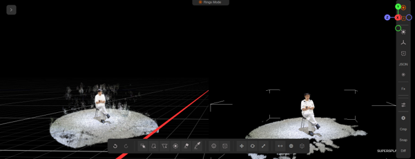
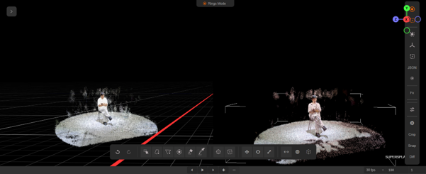
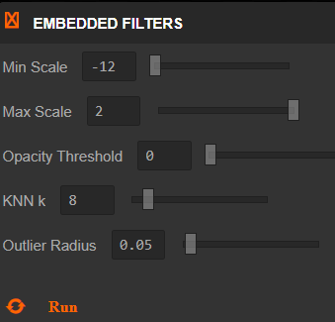
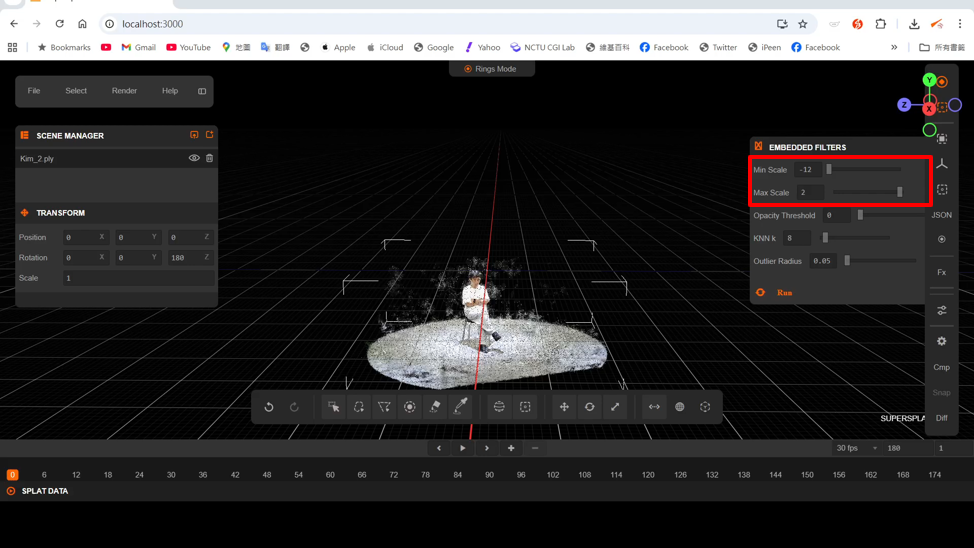
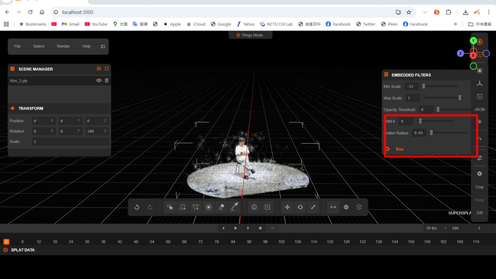
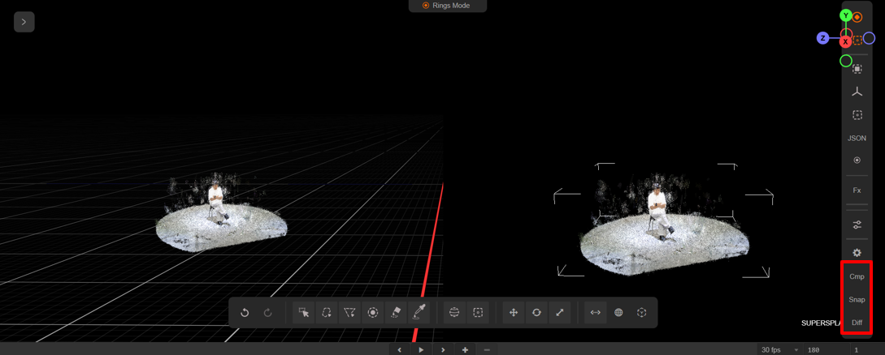

# SuperSplat Editor

[](https://github.com/playcanvas/supersplat/releases)
[](https://github.com/playcanvas/supersplat/blob/main/LICENSE)
[](https://discord.gg/RSaMRzg)
[](https://www.reddit.com/r/PlayCanvas)
[](https://x.com/intent/follow?screen_name=playcanvas)

| [SuperSplat Editor](https://superspl.at/editor) | [User Guide](https://developer.playcanvas.com/user-manual/gaussian-splatting/editing/supersplat/) | [Blog](https://blog.playcanvas.com) | [Forum](https://forum.playcanvas.com) |

The SuperSplat Editor is a free and open source tool for inspecting, editing, optimizing and publishing 3D Gaussian Splats. It is built on web technologies and runs in the browser, so there's nothing to download or install.

A live version of this tool is available at: https://superspl.at/editor


To learn more about using SuperSplat, please refer to the [User Guide](https://developer.playcanvas.com/user-manual/gaussian-splatting/editing/supersplat/).

## Contributors

SuperSplat is made possible by our amazing open source community:

<a href="https://github.com/playcanvas/supersplat/graphs/contributors">
  
</a>


# SuperSplat Editor — Final Project (Group 15)
**Gaussian Splatting Denoising: Interactive Post-Processing Filters in SuperSplat**

This project is a course final project built on top of PlayCanvas SuperSplat.
We focus on denoising 3D Gaussian Splatting reconstructions, especially removing “floaters” and surrounding noise, via an interactive workflow inside the editor.

**Goal**: 3DGS reconstructions often contain “floaters”; we leverage SAM2 + camera projection and integrate multiple interactive filters (Mask-to-3D / Scale / Opacity / Outlier) with before/after visualization.

---
### Final Results
<p>
  
  
</p>
---

## Key Features (TL;DR)

1. **Mask-to-3D selection** integrated into SuperSplat (right toolbar): import masks, import camera views, and run Mask-to-3D voting to keep valid Gaussians.
2. **Embedded Filters (right toolbar panel)**: Scale Filter, Opacity Filter, and KNN/Distance Outlier Filter for interactive denoising.
3. **Interactive Compare View (Before/After + Diff)**: split view, snapshot, and visual diff to inspect filter effects in real time.

---

## Pipeline Overview

### Preprocessing (SAM2 + COLMAP)
- Use **SAM2** to extract accurate masks from multiple viewpoints.
- Use **COLMAP camera projection** (intrinsics/extrinsics) to bridge 2D↔3D.
- Note: the SAM2 notebook may run on limited GPU (e.g., T4). Make sure the input image path is set correctly.
- For the complete preprocessing workflow, please refer to `SAM2_+_COLMAP.ipynb`.

## Preprocess Assets (Hosted Externally)

To avoid committing large files to GitHub, we host the entire `preprocess/` folder (not tracked in this repository) on a cloud drive. It contains the notebook and exported artifacts needed to generate and organize **2D masks** and **camera parameters (JSON)**, which can be directly imported into this fork (e.g., for the Mask-to-3D workflow).

### Download
- Cloud link: <https://drive.google.com/drive/folders/1HghBiLBZzr60xlmFvxkRoEfiKJ_7e6ck?usp=sharing>

### Contents (in the downloaded `preprocess/` folder)
- `SAM2_+_COLMAP.ipynb`  
  Notebook used to generate/prepare masks and camera metadata (SAM2 segmentation + COLMAP camera information).
- `cameras.json`  
  Exported camera parameters generated by `SAM2_+_COLMAP.ipynb`.
- `masks_output/`  
  Exported masks folder generated by `SAM2_+_COLMAP.ipynb` (contains per-frame / per-image masks).

### Usage
1. Download the `preprocess/` folder from the link above.
2. Place it at the repository root:


---

## In-Editor UI Guide

### A) Mask-to-3D (Right Toolbar)
We added three buttons:
- **Import Masks** (supports importing multiple masks at once)
- **Import Camera Views**
- **Mask-to-3D**


Mask-to-3D design choices:
- **Voting (keep policy)**: if *any* viewpoint marks a point as foreground, keep that point.
- **Neighborhood sampling (3×3)**: tolerate small projection errors and protect boundaries.
- **Floor protection**: reduce accidental deletion of the floor.

---

### B) Embedded Filters (Right Toolbar, “3-in-1” panel)
We integrated three denoising filters into a single panel: **Scale / Opacity / Outlier Filtering**.



#### 1) Scale Filter
- UI: “Min Scale / Max Scale”
- Behavior: keep Gaussians whose `scale` lies within the range; remove others.
- Target: remove large background remnants and small noise around the object.



#### 2) Opacity Filter
- UI: “Opacity Threshold”
- Behavior: delete Gaussians with `opacity < threshold`.
- Target: remove almost-invisible Gaussians (shadows/ghosting/transparent noise).

Demo video: [opacity-filter.mp4](docs/media/opacity-filter.mp4)

#### 3) KNN / Distance Outlier Filter
- Parameters:
  - `k`: minimum number of neighbors required
  - `radius`: effective distance range to count neighbors
- Deletion rule: within the given radius, if the number of neighbors is fewer than `k`, mark it as an outlier and delete.
- Target: remove isolated, far-away, floating noise in 3D space.



---

## Interactive Compare View (cmp / snap / diff)

We added three buttons in the right toolbar:
- **cmp**: split-screen compare
- **snap**: replace compare view with the current view
- **diff**: visualize changed splats



Technical highlights:
- **Dual-camera system**: a second camera is used to support split view and synchronized movement.
- **GPU snapshot optimization**: avoid copying complex 3D objects; snapshot GPU states (e.g., `stateTexture` and transform textures).
- **Visual diff**: bitwise comparison between snapshot and current state to mark filter effects in real time.

---

## Local Development

### Requirements
- Node.js 18+
- pnpm

### Run


## Local Development

To initialize a local development environment for SuperSplat, ensure you have [Node.js](https://nodejs.org/) 18 or later installed. Follow these steps:

1. Clone the repository:

   ```sh
   git clone git@github.com:gcobs104628/DIP.git
   cd DIP
   ```

2. Install dependencies:

   ```sh
   pnpm install
   ```

3. Build SuperSplat and start a local web server:

   ```sh
   pnpm develop
   ```

4. Open a web browser tab and make sure network caching is disabled on the network tab and the other application caches are clear:

   - On Safari you can use `Cmd+Option+e` or Develop->Empty Caches.
   - On Chrome ensure the options "Update on reload" and "Bypass for network" are enabled in the Application->Service workers tab:

   

5. Navigate to `http://localhost:3000`


